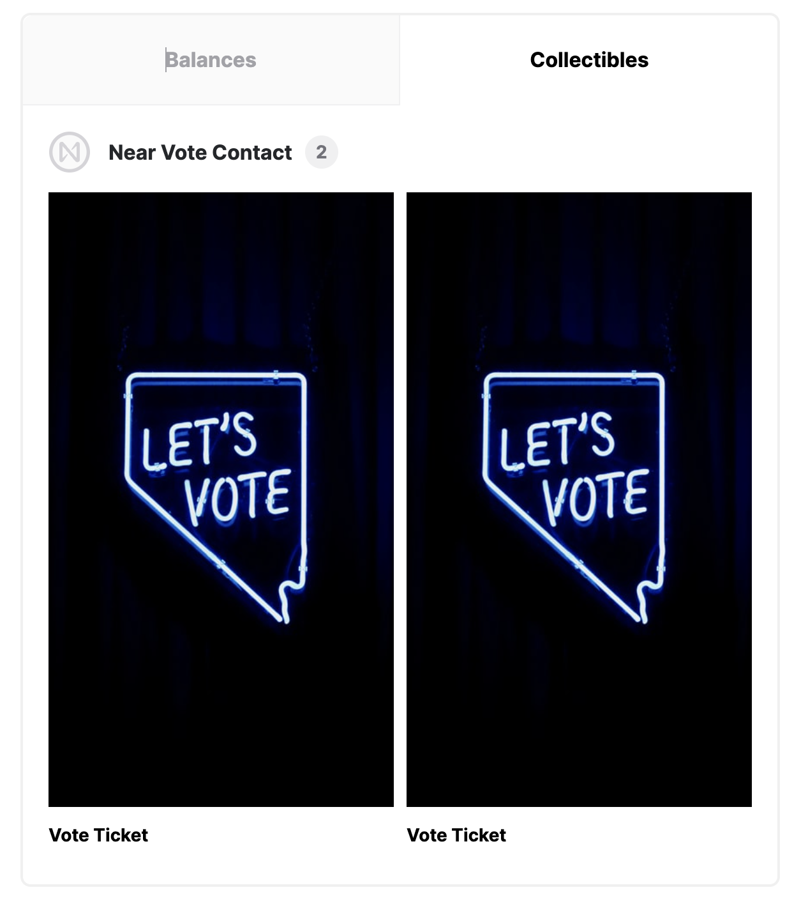

# NearElectionDApp
Near上で動作するDApp開発用のリポジトリです。

#### トレイトとは

データ型を分類する仕組みのことです。

#### near SDK  Rust

NEARスマートコントラクトを作成するためのRustライブラリ

### 動かし方

```cmd
======================================================
👋 Welcome to NEAR! Learn more: https://docs.near.org/
🔧 Let's get your dApp ready.
======================================================
(NEAR collects anonymous information on the commands used. No personal information that could identify you is shared)


Creating a new NEAR dApp

======================================================
✅  Success! Created '/Users/harukikondo/git/NearElectionDApp/near-election-dapp/frontend'
   with a smart contract in Rust and a frontend template in React.js.
🦀 If you are new to Rust please visit https://www.rust-lang.org 

  Your next steps:
   - Navigate to your project:
         cd /Users/harukikondo/git/NearElectionDApp/near-election-dapp/frontend
   - Install all dependencies
         npm run deps-install
   - Test your contract in NEAR SandBox:
         npm test
   - Deploy your contract to NEAR TestNet with a temporary dev account:
         npm run deploy
   - Start your frontend:
         npm start

🧠 Read README.md to explore further.
```

#### テストの方法

1. `cd near-election-dapp/backend`
2. `cargo test`

レスポンスの例

```cmd
    Finished test [unoptimized + debuginfo] target(s) in 6.89s
     Running unittests src/lib.rs (target/debug/deps/electionnftcontract-ad81a31e0a2e96fc)

running 3 tests
test tests::vote_closed_test ... ok
test tests::mint_test ... ok
test tests::transfer_test ... ok

test result: ok. 3 passed; 0 failed; 0 ignored; 0 measured; 0 filtered out; finished in 0.00s

   Doc-tests electionnftcontract

running 0 tests

test result: ok. 0 passed; 0 failed; 0 ignored; 0 measured; 0 filtered out; finished in 0.00s
```

#### ビルド＆デプロイの方法

1. `export NFT_CONTRACT_ID=nftcontract.dev-1660204085773-49134722844982`
2. `echo $NFT_CONTRACT_ID`
3. `near login`
4. `set -e && RUSTFLAGS='-C link-arg=-s' cargo build --target wasm32-unknown-unknown --release && near deploy --wasm-file target/wasm32-unknown-unknown/release/electionnftcontract.wasm --accountId $NFT_CONTRACT_ID`

上記4がうまくいかない場合  

4. `cargo build --target wasm32-unknown-unknown --release`
5. `ls ./target/wasm32-unknown-unknown/release | grep electionnftcontract.wasm`

続いてサブアカウントを作成する  

6. `near create-account nftcontract.dev-1660204085773-49134722844982 --masterAccount dev-1660204085773-49134722844982 --initialBalance 50`

サブアカウントを削除する場合

`near delete nftcontract.dev-1660204085773-49134722844982 dev-1660204085773-49134722844982`

スマートコントラクトをデプロイする。

7. `near deploy --wasmFile target/wasm32-unknown-unknown/release/electionnftcontract.wasm --accountId nftcontract.dev-1660204085773-49134722844982`

NFTコントラクトを初期化する。

8. `near call $NFT_CONTRACT_ID new_default_meta '{"owner_id": "'$NFT_CONTRACT_ID'"}' --accountId $NFT_CONTRACT_ID`

```cmd
https://explorer.testnet.near.org/transactions/Fs7nLnN7vzNjybGHQ8DSgVxoPZ5znJ2tCe8FrRJSopqZ
```

```cmd
https://explorer.testnet.near.org/transactions/D3zbD65MgrwtQRi4WcjMx9mwxG2jmi2rPKAbGs63eFpC
```

NFTをミントする。

9. `near call $NFT_CONTRACT_ID nft_mint '{"metadata": {"title": "Vote Ticket", "description": "First Token", "media": "https://gateway.pinata.cloud/ipfs/QmUs5K3LwdvbhKA58bH9C6FX5Q7Bhsvvg9GRAhr9aVKLyx", "media_CID": "QmUs5K3LwdvbhKA58bH9C6FX5Q7Bhsvvg9GRAhr9aVKLyx","token_kind": "vote"}, "receiver_id": "'$NFT_CONTRACT_ID'"}' --accountId $NFT_CONTRACT_ID --amount 0.1`

別の種類のNFTを発行する場合  

9. `near call $NFT_CONTRACT_ID nft_mint '{"metadata": {"title": "Tonny(candidate)", "description": "Fifth Token", "media": "https://gateway.pinata.cloud/ipfs/QmTGtuh3c1qaMdiBUnbiF9k2M3Yr4gZn8yixtAQuVvZueW", "media_CID": "QmTGtuh3c1qaMdiBUnbiF9k2M3Yr4gZn8yixtAQuVvZueW", "candidate_name": "Tonny", "candidate_manifest": "Be yourself everyone else is already taken.", "token_kind": "candidate"}, "receiver_id": "'$NFT_CONTRACT_ID'"}' --accountId $NFT_CONTRACT_ID --amount 0.1`

9. `near call $NFT_CONTRACT_ID nft_mint '{"metadata": {"title": "Rob Stark(candidate)", "description": "Forth Token", "media": "https://gateway.pinata.cloud/ipfs/QmQaBSeg58JcWkCxzGhqHiy9SSUugH9MtV8UnZQ3siMRYA", "media_CID": "QmQaBSeg58JcWkCxzGhqHiy9SSUugH9MtV8UnZQ3siMRYA", "candidate_name": "Rob Stark", "candidate_manifest": "In three words I can sum up everything I have learned about life it goes on.", "token_kind": "candidate"}, "receiver_id": "mashharuki.testnet"}' --accountId $NFT_CONTRACT_ID --amount 0.1`

9. `near call $NFT_CONTRACT_ID nft_mint '{"metadata": {"title": "Jenny Lind(candidate)", "description": "Seventh Token", "media": "https://gateway.pinata.cloud/ipfs/QmWUzLowW5ErzoezkpdSVZNF5LFgWTtMhiwfAdZU9LhcgF", "media_CID": "QmWUzLowW5ErzoezkpdSVZNF5LFgWTtMhiwfAdZU9LhcgF", "candidate_name": "Jenny Lind", "candidate_manifest": "Be yourself everyone else is already taken.", "token_kind": "candidate"}, "receiver_id": "mashharuki.testnet"}' --accountId $NFT_CONTRACT_ID --amount 0.1`

発行例  



うまく行けば下記の様に出力される。  

```cmd
Starting deployment. Account id: nftcontract.dev-1660204085773-49134722844982, node: https://rpc.testnet.near.org, helper: https://helper.testnet.near.org, file: target/wasm32-unknown-unknown/release/electionnftcontract.wasm
Transaction Id 84xHxxS8WPPuqqFBvUG3XSxxepejRyU8C1zeaWSZDeu2
To see the transaction in the transaction explorer, please open this url in your browser
https://explorer.testnet.near.org/transactions/84xHxxS8WPPuqqFBvUG3XSxxepejRyU8C1zeaWSZDeu2
Done deploying to nftcontract.dev-1660204085773-49134722844982
```
発行したトークンの情報を確認するコマンド

10. `near view $NFT_CONTRACT_ID nft_tokens`

レスポンス例  
```json
{
    owner_id: 'nftcontract.dev-1660204085773-49134722844982',
    metadata: {
      title: 'Tonny(candidate)',
      description: 'Fifth Token',
      media: 'https://gateway.pinata.cloud/ipfs/QmTGtuh3c1qaMdiBUnbiF9k2M3Yr4gZn8yixtAQuVvZueW',
      media_CID: 'QmTGtuh3c1qaMdiBUnbiF9k2M3Yr4gZn8yixtAQuVvZueW',
      candidate_name: 'Tonny',
      candidate_manifest: 'Be yourself everyone else is already taken.',
      token_kind: 'candidate',
      token_id: 0
    }
  },
  {
    owner_id: 'nftcontract.dev-1660204085773-49134722844982',
    metadata: {
      title: 'Vote Ticket',
      description: 'First Token',
      media: 'https://gateway.pinata.cloud/ipfs/QmUs5K3LwdvbhKA58bH9C6FX5Q7Bhsvvg9GRAhr9aVKLyx',
      media_CID: 'QmUs5K3LwdvbhKA58bH9C6FX5Q7Bhsvvg9GRAhr9aVKLyx',
      candidate_name: null,
      candidate_manifest: null,
      token_kind: 'vote',
      token_id: 1
    }
  }
```

別のアドレスに転送させる場合

11. `near call $NFT_CONTRACT_ID nft_transfer '{"receiver_id": "mashharuki2.testnet", "token_id": 1}' --accountId $NFT_CONTRACT_ID --depositYocto 1`

NFTに紐づく投票数を取得する場合

12. `near call $NFT_CONTRACT_ID nft_return_candidate_likes '{"token_id": 0}' --accountId $NFT_CONTRACT_ID`

レスポンス例  
```cmd
0
```

投票を行う場合

13. `near call $NFT_CONTRACT_ID nft_add_likes_to_candidate '{"token_id": 0}' --accountId $NFT_CONTRACT_ID` 

投票期間が終了しているか確認するコマンド

14. `near view $NFT_CONTRACT_ID if_election_closed`

投票期間を終了させる場合のコマンド

15. `near call $NFT_CONTRACT_ID close_election --accountId $NFT_CONTRACT_ID`

投票を再開させる場合のコマンド

16. `near call $NFT_CONTRACT_ID reopen_election --accountId $NFT_CONTRACT_ID`

#### ディレクトリ構成を出力する方法
 `tree -L 2 -F`  

 出力例  
 ```cmd
./
├── backend/
│   ├── Cargo.lock
│   ├── Cargo.toml
│   ├── src/
│   └── target/
└── frontend/
    ├── README.md
    ├── contract/
    ├── frontend/
    ├── integration-tests/
    └── package.json
 ```

### Taliwindのインストールと設定ファイルを生成するコマンド
 `npm install -D tailwindcss postcss &&  npx tailwindcss init`  

### #[payable]の役割

 [payable]は token を授受できるようにするための注釈です。

### pub(crate)の役割

pub(crate)とは、このファイル内だけで使用できる関数であることを示しています。

#### 参考文献
 1. <a href="https://tailwindcss.jp"/>Tailwind</a>
 2. <a href="https://postcss.org/">PostCSS</a>
 3. <a href="https://docs.rs/near-sdk/latest/near_sdk/">near SDK</a>